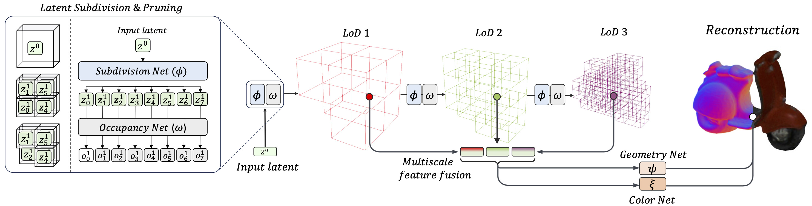

# ReFiNe: Recursive Field Networks for Cross-Modal Multi-Scene Representation

This repository contains the PyTorch implementation of our paper, **ReFiNe** (Code coming soon!)

### [Project Page](https://zakharos.github.io/projects/refine/) | [arXiv](https://arxiv.org/pdf/2406.04309)

<a href="https://zakharos.github.io/"><strong>Sergey Zakharov</strong></a>
·
<a href="https://www.thekatherineliu.com/"><strong>Katherine Liu</strong></a>
·
<a href="https://adriengaidon.com/"><strong>Adrien Gaidon</strong></a>
·
<a href="https://www.tri.global/about-us/dr-rares-ambrus"><strong>Rares Ambrus</strong></a>
 SIGGRAPH, 2024 

## Reference

<pre>
@inproceedings{refine,
    title={ReFiNe: Recursive Field Networks for Cross-Modal Multi-Scene Representation},
    author={Sergey Zakharov, Katherine Liu, Adrien Gaidon, Rares Ambrus},
    journal={SIGGRAPH},
    year={2024}
}
</pre>